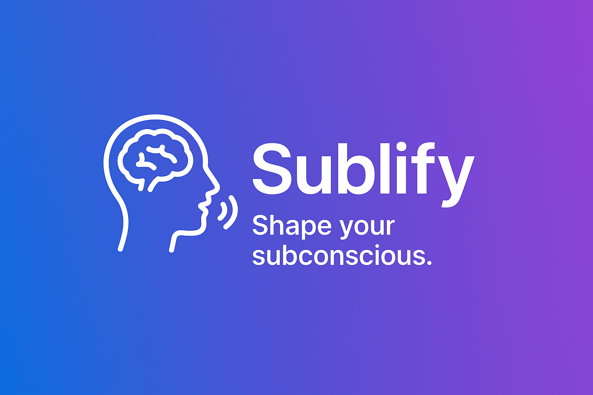

<p align="center">
  
</p>

# Sublify

**Shape your subconscious.**

Sublify is a minimal open-source app that helps you display subliminal messages on your screen.
It flashes short, positive cues at regular intervals to help reinforce habits, boost confidence, or simply remind your subconscious of what matters most.

---

## 🚀 Features
- Display short subliminal messages at configurable intervals
- Minimal design, distraction-free
- Fully open source and easy to extend

---
# Sublify - Subliminal Motivation for macOS

A sleek macOS desktop app that delivers personalized motivational messages using subliminal timing (125ms) or visible durations. Sublify makes subconscious motivation simple and effective for boosting your productivity throughout the day.

## Features

### ✨ Core Functionality

- **Customizable Intervals**: Set how often motivational content appears (in minutes)
- **Flexible Display Duration**: Control how long messages/images stay visible (in milliseconds)
- **Fullscreen Overlay**: Messages appear as fullscreen overlays that capture attention
- **Click to Dismiss**: Instantly dismiss any overlay by clicking anywhere
- **Background Operation**: Runs quietly in the background without cluttering your dock

### 🎨 Personalization

- **Custom Text Messages**: Write your own motivational quotes and affirmations
- **Custom Images**: Use personal images, photos, or graphics as motivation
- **Color Themes**: Choose from multiple background and text color combinations
- **Font Size Control**: Adjust text size for optimal readability
- **Visual Effects**: Smooth animations and professional overlay design

### ⚙️ Settings & Controls

- **Easy Configuration**: Intuitive settings panel for all customization options
- **Test Mode**: Preview your settings before activating
- **Persistent Settings**: Your preferences are automatically saved
- **Start/Stop Control**: Enable or disable the motivation system anytime

## How to Use

### Getting Started

1. **Open the App**: Launch Sublify from your Applications folder
2. **Configure Settings**: Click "Settings" to customize your experience
3. **Start Motivation**: Click "Start" to begin receiving motivational displays
4. **Enjoy**: The app will work in the background, showing your content at the specified intervals

### Customizing Your Experience

#### Text Messages
- Go to Settings → Content
- Ensure "Use custom image" is turned OFF
- Enter your motivational text in the text area
- Choose colors and font size in the Appearance section

#### Custom Images
- Go to Settings → Content
- Turn ON "Use custom image"
- Click "Browse" to select an image file
- Supported formats: JPG, PNG, GIF, and other common image formats

#### Timing Configuration
- **Show every**: How often content appears (recommended: 30-60 minutes)
- **Display for**: How long content stays visible (recommended: 2000-5000ms)

#### Visual Customization
- **Background Color**: Choose the overlay background color
- **Text Color**: Select text color for optimal contrast
- **Font Size**: Adjust text size (recommended: 36-72pt)

### Tips for Effective Use

#### Message Ideas

- Personal affirmations: "I am capable and confident"
- Goal reminders: "Focus on your priorities today"
- Motivational quotes: "Progress, not perfection"
- Health reminders: "Take a deep breath and stretch"
- Productivity boosts: "You're doing great! Keep going! 💪"

#### Timing Recommendations

- **Work Sessions**: Every 25-30 minutes (Pomodoro-style)
- **Study Sessions**: Every 45-60 minutes
- **Creative Work**: Every 20-30 minutes
- **Long Projects**: Every 60-90 minutes

#### Image Suggestions

- Personal goals or vision boards
- Inspirational landscapes or nature scenes
- Photos of loved ones or achievements
- Visual reminders of your "why"
- Progress charts or milestone images

## Technical Requirements

- **macOS**: Version 13.0 or later
- **Architecture**: Compatible with Intel and Apple Silicon Macs
- **Permissions**: File access permission for custom images
- **Display**: Works with single or multiple monitor setups

## Privacy & Security

- **Local Storage**: All settings and content stay on your device
- **No Network Access**: The app doesn't connect to the internet
- **Sandboxed**: Runs in a secure app sandbox environment
- **File Access**: Only accesses images you explicitly select

## Building from Source

### Requirements

- Xcode 15.0 or later
- macOS 13.0 or later

### Build Steps

1. Open `Sublify.xcodeproj` in Xcode
2. Select your development team in project settings
3. Build and run (⌘+R)

### Project Structure

```md
Sublify/
├── SublifyApp.swift            # Main app entry point
├── ContentView.swift           # Main interface
├── SettingsView.swift          # Configuration interface
├── OverlayView.swift           # Fullscreen display overlay
├── MotivatorManager.swift      # Core logic and timer management
├── Info.plist                  # App metadata
└── Motivator.entitlements      # Security permissions
```

## Troubleshooting

### Common Issues

**App doesn't appear in dock**

- This is intentional! The app runs as a menu bar utility for minimal distraction

**Images not loading**

- Ensure the image file path is correct
- Try using the "Browse" button instead of typing the path
- Check that the image format is supported (JPG, PNG, etc.)

**Overlays not appearing**

- Check that the app is started (green "Active" status)
- Verify your interval settings aren't too long
- Try the "Test Display" button in settings

**Settings not saving**

- Make sure to click "Save" in the settings window
- Check that the app has proper file permissions

### Performance Tips

- Use reasonable intervals (not less than 5 minutes for productivity)
- Keep display duration under 10 seconds for best user experience
- Optimize image file sizes for faster loading

## Support & Feedback

This app was created to help boost motivation and productivity through positive reinforcement. The psychological principle behind it is that regular, brief exposure to motivational content can help maintain focus and positive mindset throughout the day.

Enjoy your journey to increased motivation and productivity! 🚀
