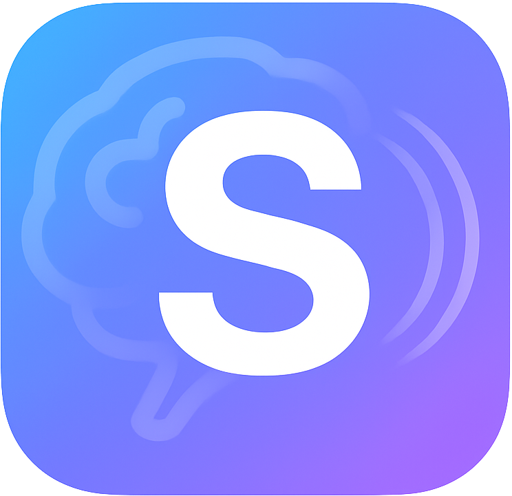

 

# Sublify

**Shape your subconscious. Reclaim your mind.**

---

## 💡 Motivation

Every day, we’re bombarded by thousands of subliminal cues—ads, logos, feeds—all designed to influence us without our awareness. Corporations spend billions planting seeds of insecurity and desire directly into our subconscious.

I built **Sublify** to **flip the script**: instead of letting outside forces shape your mind, you can use the same psychological techniques for *your own* growth—empowering beliefs, personal goals, and positive self-talk.

---

## ✨ Features

- **Customizable Intervals** – set how often content appears
- **Flexible Duration** – subliminal (125ms), quick (500ms), or visible (3000ms)
- **Text or Images** – display affirmations, reminders, or custom visuals
- **Fullscreen Overlay** – capture attention without cluttering your dock
- **Simple Controls** – click to dismiss, runs quietly in the background
- **Private & Secure** – no internet access, all data stays on your device

---

## 🚀 Getting Started

1. **Launch** Sublify from your Applications folder
2. **Customize Settings** – choose text or images, colors, and timing
3. **Start Session** – Sublify will show empowering messages at your intervals

---

## 🧠 Why It Works

### Ultra-Fast Brain Processing
MIT neuroscientists found the brain can recognize images in just **13ms**, far below conscious awareness.
📖 [MIT News: In the blink of an eye](https://news.mit.edu/2014/in-the-blink-of-an-eye-0116)

### Subliminal Priming
Research shows subliminal exposure creates **lasting neural changes**:
- Neurons extract more info from repeated stimuli
- Greater sensitivity to “primed” content
- Improved recognition and processing efficiency
📖 [Technology Networks: How Subliminal Images Impact the Brain](https://www.technologynetworks.com/neuroscience/articles/how-subliminal-images-impact-your-brain-and-behavior-344858)

### Neuroplasticity & Repetition
Your brain rewires itself based on repeated patterns. Advertising exploits this; Sublify uses it to strengthen **positive neural pathways**.

### Breaking Negative Loops
Sublify interrupts unconscious negative self-talk and replaces it with empowering cues—shifting your internal dialogue over time.

---

## 🛠️ Customization Ideas

- Affirmations: “I am capable and confident”
- Productivity cues: “Focus on your priorities today”
- Health reminders: “Take a deep breath and stretch”
- Images: vision boards, landscapes, loved ones, or milestones

---

## 🔒 Privacy

- Runs fully local
- No network access
- Sandboxed macOS app

---

## 🙌 Support

Sublify was created to **democratize subliminal techniques**—taking tools once used by advertisers and turning them into a force for personal empowerment.

Contributions, feedback, or research links are very welcome (issues & PRs open).

Enjoy your journey to mental freedom 🚀✨

— Lisztos

